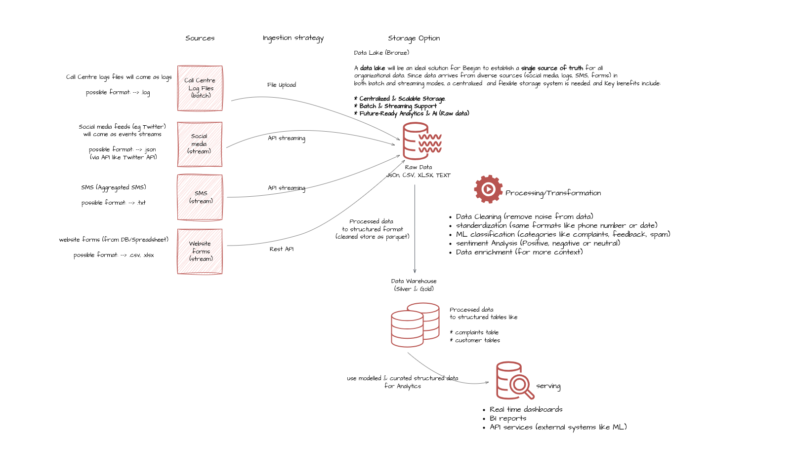

# Project Overview
### Business Scenario

You are working as a Data Engineer at a telecom company
called **Beejan Technologies**. Every day, thousands of
customers complain about issues like poor network, incorrect
billing, or bad customer service. These complaints come
through different channels: social media, call center log files,
SMS, and website forms.
The management is frustrated. Data is stored in different
formats. The reporting team manually compiles spreadsheets.
No single pipeline exists for this data flow. Reports are
delayed. Teams work in silos.
They ask you to design a solution to bring all this data
together, clean it, enrich it and make it ready to provide
actionable insights.
Your first job is to design a conceptual end-to-end data
pipeline to solve this problem.
This conceptual data pipeline will lay the foundation for
building the actual pipeline. So everything at this stage
should be about concepts not tools.

**Note:** Because this is an imaginary company, it is fine for you
to make assumptions, just be clear and communicate any
assumptions you make.

# Expected Output
- A diagram of the conceptual pipeline (you can use tools
like draw.io, lucid.app or anything you are comfortable
with).
-  A not more than 2-page written explanation covering:
    - Design choices
    - Assumptions/thought process
    - Challenges or unknowns
    - Any other information
- Don’t mention any tools.

--------------------------------------

# My Solution and thought process

### Diagram of the Conceptual Pipeline

Please refer to the diagram above for the conceptual data pipeline.

- Click [here](./beejan_case_study.drawio.png) to view the image in full size.
- Click [here](./mfon_beejan_assignment.pdf) to view the detailed explanation in PDF format.
- Click [here](./Beejan%20Technologies%20Business%20Scenario.pdf) to view the detailed explanation in Word format.